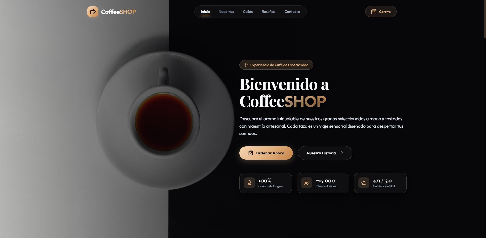
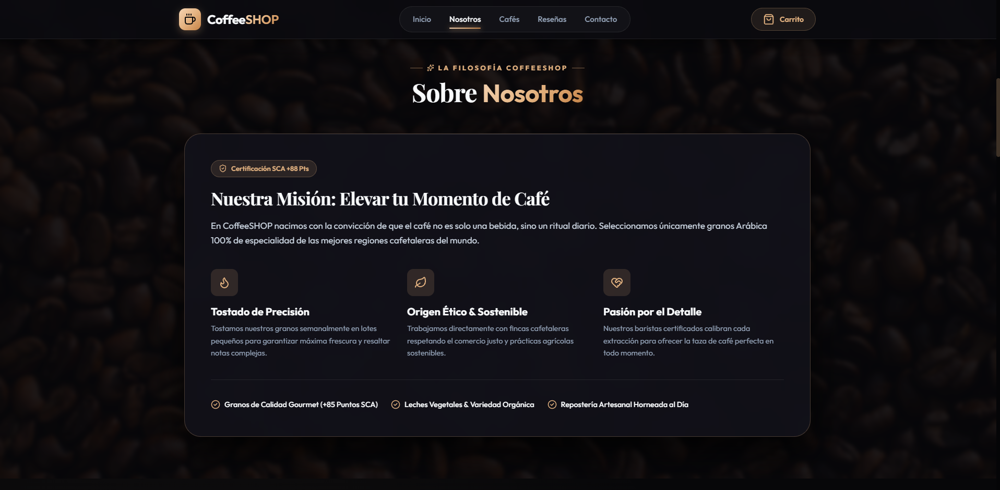
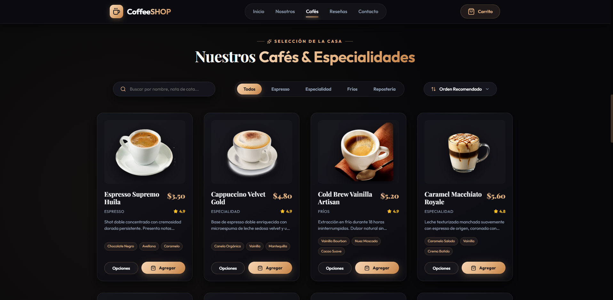
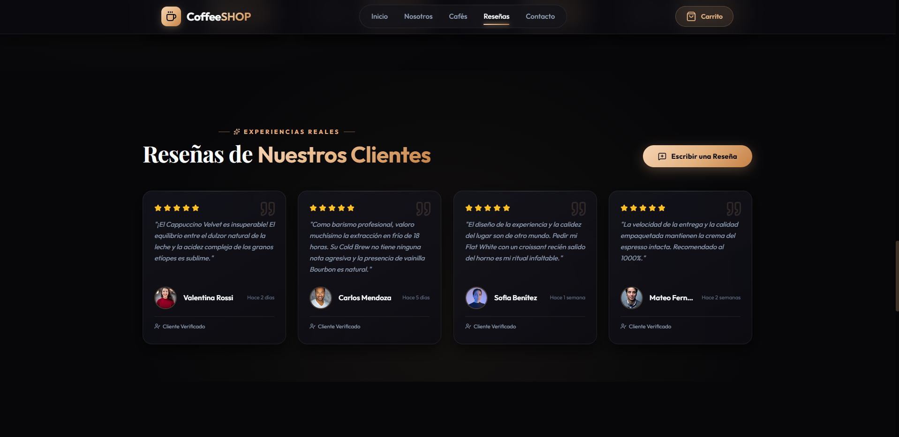
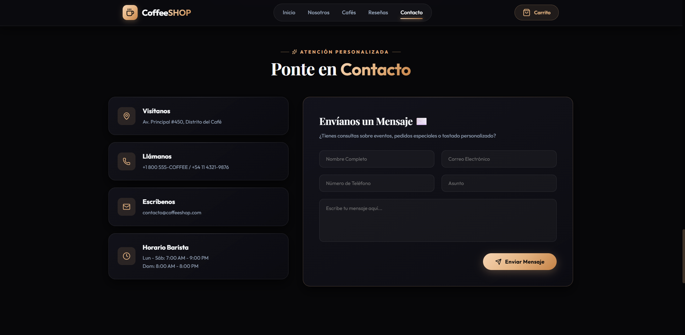
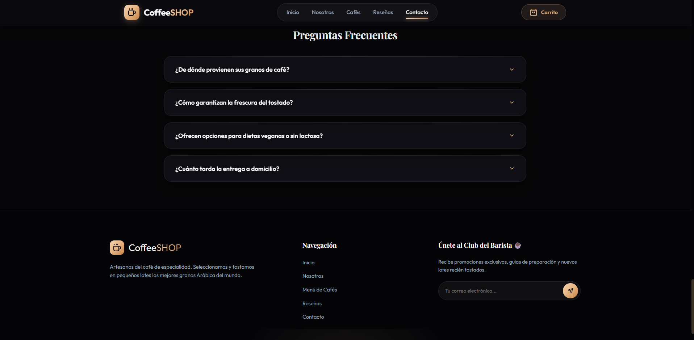

  # ☕ CoffeeSHOP | Artesanos del Café de Especialidad

  **Una experiencia digital interactiva de alta gama para los amantes del café de especialidad.**  
  Diseño *Dark Luxury*, animaciones cinemáticas con GSAP ScrollTrigger y una experiencia e-commerce fluida.

  
  
  
  

---

## ✨ Características Destacadas

* **🎨 Estética Dark Luxury & Glassmorphism**: Interfaz oscura de alta fidelidad con efectos de cristal pulido, acentos dorados cálidos y tipografías de especialidad (*Playfair Display* & *Outfit*).
* **⚡ Animaciones Cinemáticas con GSAP**: Revelado progresivo en scroll (*ScrollTrigger*), contadores numéricos animados en tiempo real y micro-interacciones.
* **☕ Personalización de Bebidas**: Selección interactiva de tamaño (*8oz, 12oz, 16oz*), tipo de leche vegetal y adiciones especiales con cálculo dinámico de precio.
* **🔍 Menú Inteligente**: Buscador rápido en tiempo real, pestañas por categoría y menú desplegable personalizado de ordenamiento.
* **🌟 Reseñas & Feedback**: Testimonios reales con carga opcional de avatar, calificación por estrellas y campo de comentarios auto-expandible.
* **✉️ Contacto & FAQ Interactivo**: Formulario fluido con validación y acordeón interactivo de preguntas frecuentes.

---

## 📸 Galería de la Aplicación

<table width="100%">
  <tr>
    <td width="50%" align="center">
      
       
      <b>01. Inicio & Experiencia de Origen</b>
    </td>
    <td width="50%" align="center">
      
       
      <b>02. Sobre Nosotros & Puntuación SCA</b>
    </td>
  </tr>
  <tr>
    <td width="50%" align="center">
      
       
      <b>03. Catálogo & Filtros Inteligentes</b>
    </td>
    <td width="50%" align="center">
      
       
      <b>04. Personalización & Opciones Barista</b>
    </td>
  </tr>
  <tr>
    <td width="50%" align="center">
      
       
      <b>05. Reseñas de Clientes & Valoraciones</b>
    </td>
    <td width="50%" align="center">
      
       
      <b>06. Atención Personalizada & FAQ</b>
    </td>
  </tr>
</table>

---

  Desarrollado con pasión por <a href="https://waveframe.com.ar/" target="_blank"><b>WaveFrame Studio</b></a> • © 2026 CoffeeSHOP

